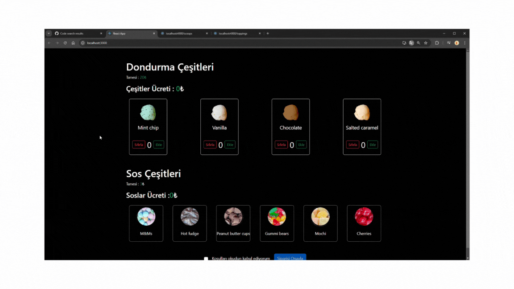

# Kütüphaneler

- axios@^0.27.2
- @testing-library/user-event@14.0
- json-server
- bootstrap

# Proje Hakkında

Bu proje, kullanıcıların dondurma seçimleri yapabildiği, ekleme ve sıfırlama işlemleri ile toplam ücretin gösterildiği basit bir uygulamadır. Soslar için de aynı işlemler uygulanabilir. Alttaki onay kutusu işaretlenmeden siparişi onayla butonu aktif hale gelmez. Buton etkinleştirildiğinde, kullanıcıyı bilgilendiren bir uyarı mesajı görünür. Proje kapsamındaki tüm özellikler, birim testleri ile test edilmiş ve başarılı sonuçlar alınmıştır ve başarılı sonuçlar elde edilmiştir.

